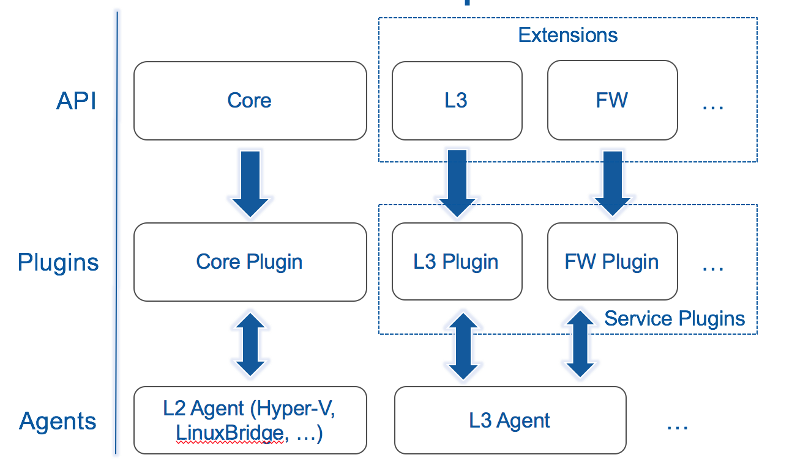

# Components

We can classify Neutron components in three main parts:
* API level: handles API server, authentication and authorization, dispatch
* Plugin (implementation level): contains the implementation code of the API. The Core Plugin implements the core API whereas the service plugins implement extensions.
* Agents: invoke commands to realize networking functionality on the machines

