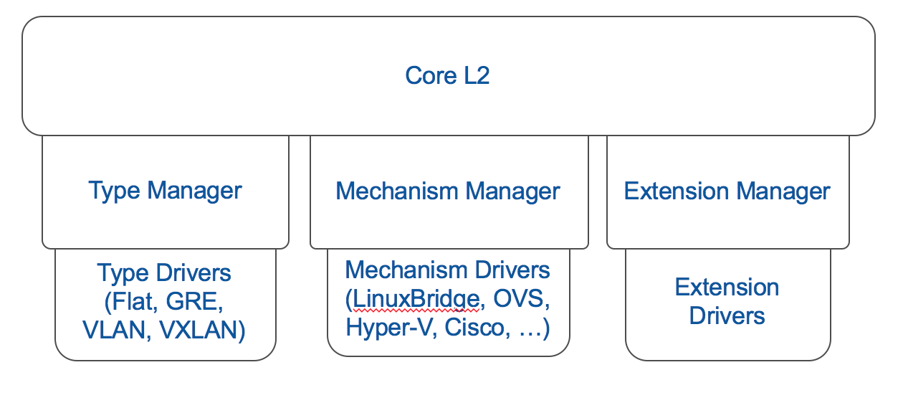

# ML2 Plugin

The Modular Layer 2 (ML2) plugin is an implementation of Neutron's core API that has been designed with the goal of allowing Neutron to utilize simultaneously the many different L2 technologies found in complex data centers. Its architecture is extensible by design.

### Type drivers
Each type driver manages a different network type. Type drivers perform tenant network allocation and provider network validation. The standard drivers included in ML2 are local, flat, vlan, gre and vxlan.

### Mechanism drivers
Each mechanism driver manages a different networking mechanism. Mechanism drivers ensure that the network configuration is properly applied to the mechanism that are in use. They usually do it by communicating with agents via RPC.

### Extension drivers
Extension drivers, introduced on the Juno release, allow developers extend the core resources API without patching the core plugin.
